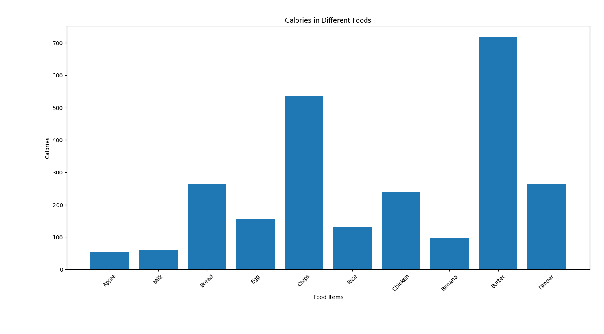

# Nutritional Profiling and Classification System

## 📌 Overview
This project is a Python-based system that analyzes food items based on their macronutrient composition and classifies them into categories such as High Fat, Protein Rich, High Carb, and Balanced.

## 🎯 Features
- Nutritional classification using rule-based logic
- Data analysis using Pandas
- Visualization of calorie distribution
- Simple and easy-to-understand system

## 🛠️ Technologies Used
- Python
- Pandas
- Matplotlib

## 📊 Output
The system generates a bar chart showing calorie distribution among different food items.



## ▶️ How to Run

1. Navigate to the project folder:

```bash
cd nutritional-profiling-system
Install required libraries:
pip install -r requirements.txt
Run the program:
python main.py
3. ## 🧠 Application
- Nutritional analysis
- Food product development
- Diet planning
- Food quality assessment

## 👤 Author
Sakshi Chakane
